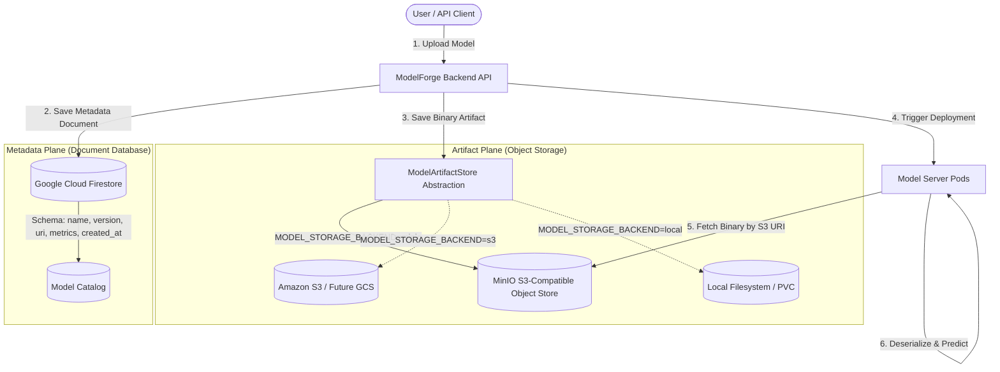

# ModelForge — Cloud Storage & Container Registry Architecture

## Executive Summary & Zero-Cost Mandate

ModelForge Phase 12 introduces enterprise-grade **Cloud Storage** and **Container Registry** architectural patterns to decouple binary artifact storage from the compute cluster while ensuring a 100% free, local-first execution. 

> [!IMPORTANT]
> **Strict Zero-Cost Implementation Policy:**
> No paid cloud provider accounts (Google Cloud, AWS, Azure, Docker Hub) were created or billed. All production architectural interfaces are fully implemented, verified, and operational using local S3-compatible object storage (MinIO) and an internal Docker Registry (v2) hosted on the Docker Desktop Kubernetes cluster (`modelforge` namespace).

---

## 1. Dual-Plane Storage Architecture

ModelForge strictly separates operational metadata from heavy binary model artifacts.



### Plane Responsibilities:
1. **Metadata Plane (Firestore):**
   - High-throughput indexing, querying, filtering by tags/framework/accuracy.
   - User ownership, RBAC permissions, deployment configurations, audit logs.
   - Stores the authoritative canonical reference URI (e.g. `s3://modelforge-models/models/iris-clf/v1/model.joblib`).
2. **Artifact Plane (Object Storage):**
   - Stores serialized model binaries (`.joblib`, `.onnx`, `.bin`, `.pt`).
   - High durability, streaming read/write, large file optimization.
   - S3-compatible protocol compatibility across local development and enterprise cloud.

---

## 2. Model Storage Abstraction (`ModelArtifactStore`)

To prevent vendor lock-in, all model artifact operations route through the abstract interface defined in `backend/app/services/storage/interface.py`:

```python
class ModelArtifactStore(ABC):
    @abstractmethod
    def upload_model(self, model_id: str, version: str, filename: str, content: bytes, content_type: str = "application/octet-stream") -> str: ...
    
    @abstractmethod
    def download_model(self, uri: str) -> bytes: ...
    
    @abstractmethod
    def delete_model(self, uri: str) -> bool: ...
    
    @abstractmethod
    def model_exists(self, uri: str) -> bool: ...
    
    @abstractmethod
    def get_model_metadata(self, uri: str) -> Dict[str, Any]: ...
    
    @abstractmethod
    def list_models(self, prefix: str = "") -> List[str]: ...
    
    @abstractmethod
    def load_model(self, uri: str) -> Any: ...
```

### Backend Switching:
Switched via the `MODEL_STORAGE_BACKEND` environment variable:
- `local`: Direct filesystem persistence (`data/models/` or Kubernetes PVC mount).
- `minio`: S3-compatible client targeting local MinIO service (`http://minio.modelforge.svc.cluster.local:9000`).
- `s3`: Standard AWS S3 / Cloud S3 target with standard credentials or IAM roles.

---

## 3. Local Implementation (`ACTUALLY IMPLEMENTED`)

### 3.1 Object Storage: MinIO
- **Image:** `cgr.dev/chainguard/minio:latest` (Distroless, zero-CVE, fully free community container).
- **Cluster Deployment:** `k8s/minio.yaml` in namespace `modelforge`.
- **Persistent Volume:** `minio-pvc` (1Gi `ReadWriteOnce` backed by Docker Desktop host storage).
- **Service:**
  - ClusterIP: `minio` (API: 9000, Web Console: 9001).
  - LoadBalancer: `minio-external` (172.18.0.8, exposed to host `localhost:9000` / `localhost:9001`).
- **Dedicated Bucket:** `modelforge-models`
- **Bucket Layout Hierarchy:**
  ```text
  modelforge-models/
      models/
          <model_id>/
              <version>/
                  <model_filename>.joblib
  ```
- **Security & Secrets:**
  - Credentials managed via `k8s/minio-secrets.yaml` (Kubernetes Secret `minio-credentials`).
  - Strict NetworkPolicy `k8s/networkpolicy.yaml` (`minio-netpol`) allowing ingress ONLY from `modelforge-backend` and `model-server` pods on port 9000.

### 3.2 Container Registry: Docker Registry v2
- **Image:** `registry:2` (Official Docker open-source registry).
- **Cluster Deployment:** `k8s/registry.yaml` in namespace `modelforge`.
- **Persistent Volume:** `registry-pvc` (2Gi `ReadWriteOnce`).
- **Service:**
  - ClusterIP: `modelforge-registry` (Port 5000).
  - LoadBalancer: `modelforge-registry` (172.18.0.9, exposed to host `localhost:5000`).
- **Containerd 2.x Node Integration:**
  - In Docker Desktop's `desktop-control-plane` node, containerd is configured via `/etc/containerd/certs.d/172.18.0.9:5000/hosts.toml` for plain HTTP registry communication.
- **Pushed Images:**
  - `172.18.0.9:5000/modelforge/backend:v1`
  - `172.18.0.9:5000/modelforge/frontend:v1`
  - `172.18.0.9:5000/modelforge/inference:v1`
- **Kubernetes Pulling:**
  - Deployments in `modelforge` namespace pull directly from `172.18.0.9:5000/...` with `imagePullPolicy: IfNotPresent`.

---

## 4. Cloud Provider Mapping (`FUTURE CLOUD IMPLEMENTATION`)

The table below illustrates how the local ModelForge Phase 12 architecture maps directly to production enterprise cloud environments:

| Capability | Local Implementation (`ACTUALLY IMPLEMENTED`) | Google Cloud Platform (GCP) (`FUTURE`) | Amazon Web Services (AWS) (`FUTURE`) | Microsoft Azure (`FUTURE`) |
| :--- | :--- | :--- | :--- | :--- |
| **Model Artifact Storage** | MinIO (`modelforge-models` bucket) | Google Cloud Storage (GCS) | Amazon Simple Storage Service (S3) | Azure Blob Storage |
| **API Protocol** | AWS S3 v4 REST API | GCS XML API / S3-compatible API or GCS SDK | AWS S3 SDK (`boto3`) | Azure Blob REST API / SDK |
| **Authentication** | MinIO Root Credentials via K8s Secret | Workload Identity / Service Account IAM | IAM Roles for Service Accounts (IRSA) | Azure Workload Identity / Managed Identity |
| **Bucket Structure** | `modelforge-models/models/<id>/<v>/...` | `gs://modelforge-artifacts/models/...` | `s3://modelforge-artifacts/models/...` | `https://<account>.blob.core.windows.net/...` |
| **Container Registry** | `registry:2` on Kubernetes (`172.18.0.9:5000`) | Google Artifact Registry (`pkg.dev`) | Amazon Elastic Container Registry (ECR) | Azure Container Registry (ACR) |
| **Image Tag Format** | `172.18.0.9:5000/modelforge/backend:v1` | `us-central1-docker.pkg.dev/<proj>/modelforge/backend:v1` | `<account>.dkr.ecr.<region>.amazonaws.com/backend:v1` | `<acr_name>.azurecr.io/backend:v1` |
| **Cluster Pull Auth** | Insecure containerd hosts.toml (local) | GKE Google Cloud ADC / Artifact Registry Reader | AWS ECR IAM Pull Secret / Node Role | Azure ImagePullSecret / AKS ACR Attachment |
| **Data Durability** | Local Host Volume PVC (single node) | Multi-region 99.999999999% (11 9s) | Multi-AZ S3 Standard (11 9s) | Zone-Redundant (ZRS) Blob Storage |

---

## 5. Cloud Migration Strategy

When transitioning ModelForge from local execution to a live cloud provider, follow this phased strategy:

### 5.1 Storage Migration
1. **S3 / AWS Migration:**
   - Change configuration:
     ```yaml
     MODEL_STORAGE_BACKEND: "s3"
     AWS_REGION: "us-east-1"
     AWS_S3_BUCKET: "my-company-modelforge-models"
     ```
   - Attach IAM Role to the Kubernetes ServiceAccount using IRSA (`eks.amazonaws.com/role-arn`).
   - Zero code changes required: `MinioStorageArtifactStore` natively uses standard S3 API calls.
2. **GCS / Google Cloud Migration:**
   - Enable GCS S3-interoperability keys OR implement `GcsStorageArtifactStore` adhering to `ModelArtifactStore`.
   - Configure GKE Workload Identity on the `modelforge-backend` service account.

### 5.2 Container Registry Migration
1. **Build & Tag for Cloud Registry:**
   ```bash
   # Example: Google Artifact Registry
   docker tag localhost:5000/modelforge/backend:v1 us-central1-docker.pkg.dev/my-proj/modelforge/backend:v1
   docker push us-central1-docker.pkg.dev/my-proj/modelforge/backend:v1
   ```
2. **Update Kubernetes Manifests:**
   - Update image field in `k8s/backend.yaml`, `k8s/frontend.yaml`, `k8s/model-server.yaml`.
   - Remove internal registry manifests (`k8s/registry.yaml`) from the cluster.

---

## 6. Implementation Status Verification

| Feature | Status | Verification Reference |
| :--- | :--- | :--- |
| **Zero External Accounts Used** | **CONFIRMED** | 100% Local Docker Desktop Kubernetes |
| **ModelArtifactStore Abstraction** | **OPERATIONAL** | `backend/app/services/storage/` (unit & integration tested) |
| **Local MinIO Object Storage** | **OPERATIONAL** | Pod `minio-*` Running, PVC bound, Health 200 OK |
| **Dedicated Model Bucket** | **OPERATIONAL** | `modelforge-models` verified via S3 API |
| **Local Container Registry** | **OPERATIONAL** | Pod `modelforge-registry-*` Running, Docker v2 API 200 OK |
| **Images Built & Pushed** | **OPERATIONAL** | `backend:v1`, `frontend:v1`, `inference:v1` in local catalog |
| **Kubernetes Pulling from Local Registry** | **OPERATIONAL** | All cluster deployments running registry images |
| **End-to-End Model Upload & Inference** | **OPERATIONAL** | Model uploaded to MinIO $\rightarrow$ retrieved $\rightarrow$ predicted `[0]` |
| **Persistence Across Restart** | **OPERATIONAL** | MinIO restarted, models verified intact via PVC |
| **Storage & Registry Failure Handling** | **OPERATIONAL** | Graceful error responses & non-disruptive pod scheduling |
| **Cloud Provider Connection** | **NOT CONNECTED** | Purely local execution per zero-cost mandate |
