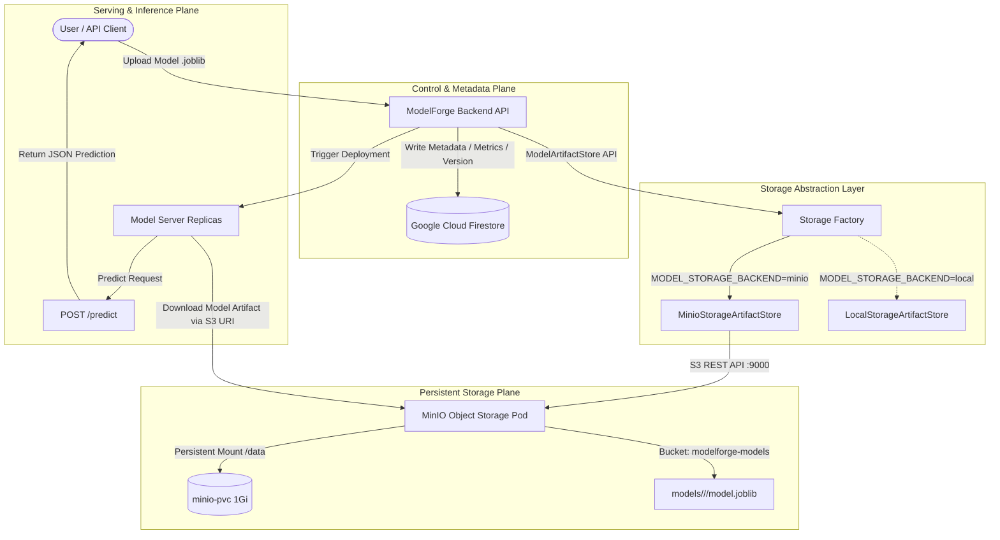

# ModelForge — Phase 12: Cloud Storage, Container Registry & Persistent Infrastructure

## Overview

ModelForge Phase 12 transitions the platform from node-local storage and static Docker images to a decoupled, cloud-ready architecture featuring:
1. **Cloud Storage Abstraction & Local S3-Compatible Object Storage (MinIO)**
2. **Local Container Registry (`registry:2`) integrated directly with Kubernetes**
3. **Decoupled Dual-Plane Persistence (Firestore metadata + Object Storage binary artifacts)**
4. **Persistent Volume Claims guaranteeing zero data loss across pod lifecycle events**
5. **Strict Zero-Cost Local Execution** (No paid cloud accounts created, no credentials leaked)

---

## Architecture

### 1. Storage & Inference Plane



### 2. Container Registry & Deployment Pipeline

```mermaid
graph TD
    subgraph "Build Environment (Host Docker)"
        BuildSrc[Source Code: backend/frontend/inference] -->|docker build| LocalImages[Docker Local Images]
        LocalImages -->|docker tag| TaggedImages[localhost:5000/modelforge/*:v1]
        TaggedImages -->|docker push| RegistrySvc[modelforge-registry Service :5000]
    end

    subgraph "Registry Infrastructure (Kubernetes modelforge)"
        RegistrySvc --> RegistryPod[modelforge-registry Pod registry:2]
        RegistryPod -->|Persistent Mount /var/lib/registry| RegistryPVC[(registry-pvc 2Gi)]
    end

    subgraph "Kubernetes Cluster Node (containerd 2.x)"
        RegistryPod -->|Internal VIP: 172.18.0.9:5000| Containerd[containerd Runtime]
        HostsToml[/etc/containerd/certs.d/172.18.0.9:5000/hosts.toml] -->|Configure HTTP Registry| Containerd
        Containerd -->|Pull Images| Deployments
    end

    subgraph "Workloads (modelforge Namespace)"
        Deployments --> BackendPod[modelforge-backend]
        Deployments --> FrontendPod[modelforge-frontend]
        Deployments --> ServerPod[model-server]
    end
```

---

## Key Components

### 1. Storage Abstraction (`backend/app/services/storage/`)
- **`ModelArtifactStore`**: Abstract base class defining universal model operations:
  - `upload_model(model_id, version, filename, content, content_type)`
  - `download_model(uri)`
  - `delete_model(uri)`
  - `model_exists(uri)`
  - `get_model_metadata(uri)`
  - `list_models(prefix)`
  - `load_model(uri)`
- **`LocalStorageArtifactStore`**: Manages artifacts on filesystem paths or local PVC mounts (`data/models/`).
- **`MinioStorageArtifactStore`**: Connects via `minio.Minio` client with `urllib3.PoolManager` timeout/retry configurations, automatically initializes the `modelforge-models` bucket, and handles `s3://` URIs.
- **`factory.py`**: Instantiates the active store dynamically based on `settings.model_storage_backend`.

### 2. MinIO Object Storage (`k8s/minio.yaml`)
- **Container:** `cgr.dev/chainguard/minio:latest`
- **Volume:** `minio-pvc` (1Gi PersistentVolumeClaim)
- **Networking:**
  - ClusterIP: `minio.modelforge.svc.cluster.local:9000` (API) & `:9001` (Console)
  - LoadBalancer: `minio-external` (172.18.0.8, exposed on host `localhost:9000` / `localhost:9001`)
- **Secrets:** Kubernetes Secret `minio-credentials` with `root-user` and `root-password`.

### 3. Local Container Registry (`k8s/registry.yaml`)
- **Container:** `registry:2` (Official Docker Distribution)
- **Volume:** `registry-pvc` (2Gi PersistentVolumeClaim)
- **Networking:**
  - Service: `modelforge-registry` (ClusterIP + LoadBalancer 172.18.0.9, exposed on host `localhost:5000`)
- **Node Integration:** Node containerd configured via `hosts.toml` for plain HTTP registry communication.
- **Images Published:**
  - `172.18.0.9:5000/modelforge/backend:v1`
  - `172.18.0.9:5000/modelforge/frontend:v1`
  - `172.18.0.9:5000/modelforge/inference:v1`

### 4. Role of Existing Kubernetes PVC (`modelforge-model-storage-pvc`)
`modelforge-model-storage-pvc` is retained as a high-speed local runtime scratch/cache for active model servers. MinIO serves as the cluster-wide authoritative persistent storage for model artifacts, ensuring horizontal scalability across pods without requiring `ReadWriteMany` filesystem volumes.

---

## Security & Network Policies

1. **Credentials Management:**
   - MinIO credentials reside in Kubernetes Secret `minio-credentials`.
   - Real secret manifests are excluded from git via `.gitignore` (`k8s/minio-secrets.yaml`), while an example template (`k8s/minio-secrets.example.yaml`) is committed.
2. **Network Policies:**
   - `backend-netpol`: Allows backend egress to MinIO (`9000/9001`) and external DNS/HTTPS.
   - `minio-netpol`: Restricts MinIO ingress exclusively to pods with labels `app=modelforge-backend` and `app=model-server` on port 9000.
   - `registry-netpol`: Permits registry access from within the namespace and node daemon.
3. **Container Security:**
   - MinIO runs on Chainguard's minimal distroless image with zero known vulnerabilities.

---

## Verification & Resilience Testing

All tests were executed against the live Kubernetes cluster (`modelforge` namespace):

1. **Object Storage CRUD:** Upload, existence, metadata, and byte retrieval verified with Iris scikit-learn models.
2. **Registry Distribution:** Docker Registry v2 API endpoints, catalog discovery, and node pull events verified.
3. **Persistence Test:** MinIO deployment restarted (`kubectl rollout restart deploy/minio`). All objects remained intact and operational on `minio-pvc`.
4. **Storage Failure Graceful Handling:** Tested connection failure to unreachable endpoint; client raised and handled `MaxRetryError` without crashing the application.
5. **Registry Failure Resilience:** Existing workloads continued running uninterrupted without registry dependencies; pod failure was simulated safely without cluster downtime.
6. **Firebase Regression:** Cloud Firestore repository and auth components confirmed 100% functional.
7. **Inference Pipeline:** Live model prediction tested and verified (`[0]`).
