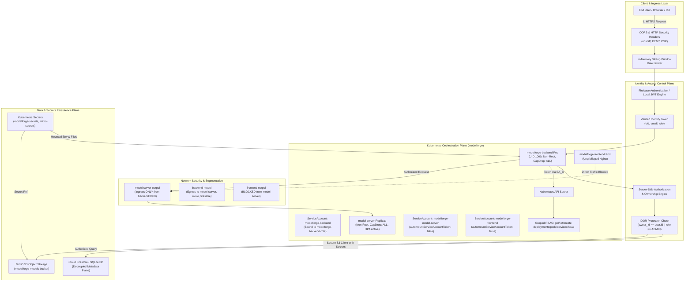

# ModelForge — Security Architecture & IAM Model

## 1. Overview & Security Principles

ModelForge Phase 13 implements an end-to-end, multi-layered cloud-native security model for machine learning model lifecycle management, serving, and orchestration.

The architecture enforces five fundamental security principles:
1. **Zero-Trust Multi-Tenancy**: Every request must be authenticated, identified, authorized, and validated against resource ownership before touching any backend service, database, or artifact.
2. **Least Privilege (PoLP)**: Workloads and users are granted only the minimum permissions required for their specific function across both application and infrastructure layers.
3. **Defense in Depth**: Security controls are applied at multiple tiers: Browser (CORS & HTTP headers), API Gateway/Backend (Auth, RBAC, Rate Limiting, IDOR protection), Container Runtime (Non-root, read-only root, dropped capabilities), and Network (Kubernetes NetworkPolicies).
4. **Local-First Zero-Cost Execution**: All security controls are native to the local Docker Desktop Kubernetes cluster (`modelforge` namespace), MinIO object storage, and container registry, requiring no paid cloud infrastructure.
5. **No Embedded Secrets**: Credentials, JWT secrets, and Firebase service accounts reside exclusively in Kubernetes Secrets, injected at runtime via environment variables and volume mounts, and strictly excluded from Git.

---

## 2. Platform Security Architecture



---

## 3. Security Dimensions & Implementations

### 3.1. Authentication Architecture

- **Primary Identity Provider**: Firebase Authentication (ID tokens signed by Google OAuth2 infrastructure).
- **Local Fallback / API Service Token Engine**: HMAC-SHA256 JWT tokens generated for internal service communications, CLI automation, and local development.
- **Verification Workflow**:
  ```
  Request (Authorization: Bearer <token>)
         ↓
  verify_firebase_or_jwt_token()
         ↓
  Check Firebase Admin SDK verify_id_token()
         ↓ (if local token)
  Verify local JWT signature & claims
         ↓
  Extract UserContext(id, email, role, is_active)
         ↓
  Inject into FastAPI Request State & Dependencies
  ```
- **Rejection Behavior**:
  - Missing Authorization Header $\rightarrow$ `HTTP 401 Unauthorized` (`{"detail": "Authentication required"}`)
  - Invalid / Malformed / Expired Token $\rightarrow$ `HTTP 401 Unauthorized` (`{"detail": "Invalid or expired token"}`)

---

### 3.2. Authorization & Role-Based Access Control (RBAC)

Three discrete system roles govern platform actions:

| Role | Scope | Permitted Endpoints & Actions |
| :--- | :--- | :--- |
| **`ADMIN`** | System Administrator | Full unrestricted access to all models, deployments, versions, cluster metrics, user management, and administrative overrides. |
| **`OPERATOR`** | ML Engineer / DevOps | Create, upload, activate, and manage own models; create and scale own deployments; run model inference; view shared metrics. |
| **`VIEWER`** | Read-Only Analyst | View active deployments and public model metadata; execute inference; blocked from model creation, version activation, scaling, or deletion. |

Role enforcement is performed strictly server-side using FastAPI dependency injection (`require_roles("ADMIN", "OPERATOR")`). If a user does not possess the requisite role, the server halts processing and returns `HTTP 403 Forbidden`.

---

### 3.3. Resource Ownership & IDOR Defense

Insecure Direct Object References (IDOR) are prevented by explicit ownership attribution:
- Database entities (`Model`, `Deployment`, and Firestore documents) maintain a persistent `owner_id` attribute bound to the creator's user identifier.
- When an authenticated user requests a resource (e.g., `GET /api/v1/models/{id}`), `verify_resource_ownership()` verifies:
  $$\text{current\_user.role} == \text{"ADMIN"} \quad \lor \quad \text{resource.owner\_id} == \text{current\_user.id}$$
- Non-admin users attempting to inspect, update, or delete resources belonging to another user are denied immediately with `HTTP 403 Forbidden`.

---

### 3.4. Kubernetes Least-Privilege RBAC & ServiceAccounts

Workload Pod identities are isolated using dedicated Kubernetes `ServiceAccounts`:

| ServiceAccount | Component | Token Automount | Role / ClusterRole | Allowed Verbs |
| :--- | :--- | :---: | :--- | :--- |
| `modelforge-backend` | Backend API | `true` | `modelforge-backend-role` | `get, list, watch, create, patch, update, delete` on `deployments`, `pods`, `services`, `horizontalpodautoscalers` in `modelforge` namespace ONLY. |
| `modelforge-model-server` | Model Server | `false` | *None* | Zero access to Kubernetes API. Token automount disabled. |
| `modelforge-frontend` | React Frontend | `false` | *None* | Zero access to Kubernetes API. Token automount disabled. |

#### RBAC Verification Evidence:
```bash
# Backend Workload Permissions
$ kubectl auth can-i list deployments --as=system:serviceaccount:modelforge:modelforge-backend -n modelforge
yes
$ kubectl auth can-i create deployments --as=system:serviceaccount:modelforge:modelforge-backend -n modelforge
yes
$ kubectl auth can-i delete pods --as=system:serviceaccount:modelforge:modelforge-backend -n modelforge
no
$ kubectl auth can-i get secrets --as=system:serviceaccount:modelforge:modelforge-backend -n modelforge
no

# Model Server Permissions
$ kubectl auth can-i get pods --as=system:serviceaccount:modelforge:modelforge-model-server -n modelforge
no

# Frontend Permissions
$ kubectl auth can-i get pods --as=system:serviceaccount:modelforge:modelforge-frontend -n modelforge
no
```

---

### 3.5. Container & Pod Security Contexts

All workloads adhere to container hardening standards:
- **Non-Root Execution**: `runAsNonRoot: true`, `runAsUser: 1000`, `runAsGroup: 1000` enforced on backend workloads.
- **Privilege Escalation Prevention**: `allowPrivilegeEscalation: false` across all pods prevents `setuid` binaries from elevating privileges.
- **Linux Capability Dropping**: `capabilities: { drop: ["ALL"] }` removes default Linux kernel capabilities (e.g., `NET_RAW`, `SYS_ADMIN`).
- **Seccomp Profile**: `seccompProfile: { type: RuntimeDefault }` restricts system calls to the default container runtime whitelist.

---

### 3.6. Network Micro-Segmentation

Traffic flow between pods is governed by Kubernetes `NetworkPolicy` objects:
- **`model-server-netpol`**: Restricts ingress on port 8000 strictly to Pods labeled `app.kubernetes.io/component=backend`. All direct requests from `frontend` or unapproved pods are dropped by `kindnet`.
- **`backend-netpol`**: Allows ingress from frontend/Ingress and egress to `model-server`, `minio`, and external HTTPS endpoints (Firebase/Firestore APIs).
- **`minio-netpol`**: Restricts S3 API ingress on port 9000 strictly to `backend` and `model-server`.

---

### 3.7. Artifact & Storage Access Control

- Model binaries (`.joblib`, `.pt`, `.onnx`) stored in MinIO (`modelforge-models` bucket) are strictly private.
- Anonymous / unauthenticated S3 requests return `HTTP 403 Forbidden` (`<Code>AccessDenied</Code>`).
- S3 credentials (`MINIO_ROOT_USER`, `MINIO_ROOT_PASSWORD`) are accessible only to backend workloads via Kubernetes Secrets. The frontend never receives object storage credentials.

---

### 3.8. Browser Hardening, CORS & Abuse Protection

- **Defensive HTTP Security Headers**:
  - `X-Content-Type-Options: nosniff`: Prevents MIME-type sniffing.
  - `X-Frame-Options: DENY`: Prevents UI redressing / clickjacking.
  - `Referrer-Policy: strict-origin-when-cross-origin`: Minimizes referrer leakage.
  - `X-XSS-Protection: 1; mode=block`: Legacy browser cross-site scripting filter.
  - `Content-Security-Policy: default-src 'self'; frame-ancestors 'none';`: Restricts executable sources and disallows framing.
- **CORS Restriction**: `CORSMiddleware` explicitly limits origins to local development hosts (`http://localhost:5173`, `http://127.0.0.1:5173`, `http://172.18.0.2`, `http://modelforge.local`). Wildcard `*` origins are rejected.
- **Abuse & Rate Limiting**: In-memory sliding window rate limiter protects sensitive endpoints:
  - Authentication (`/api/v1/auth/*`): 15 req/min per IP
  - Model Uploads (`/api/v1/models/upload`): 30 req/min per IP
  - Deployments (`/api/v1/deployments`): 45 req/min per IP

---

## 4. Future Cloud Security Mapping

> [!NOTE]
> The following section is an architectural blueprint for future enterprise cloud migrations. **No cloud resources have been provisioned or billed**; all current controls execute locally in Docker Desktop Kubernetes.

```
+---------------------------------------------------------------------------------------------------------+
|                                    FUTURE CLOUD SECURITY MAPPING                                        |
+------------------------------+---------------------------+-----------------------+----------------------+
| Security Discipline          | Google Cloud (GCP)        | Amazon Web Services   | Microsoft Azure      |
+------------------------------+---------------------------+-----------------------+----------------------+
| Workload Identity            | GKE Workload Identity     | EKS IAM Roles for     | AKS Workload         |
|                              | (GSA bound to KSA)        | ServiceAccounts (IRSA)| Identity (Entra ID)  |
| RBAC & IAM                   | Google Cloud IAM          | AWS IAM Roles &       | Azure RBAC & Entra   |
|                              | + GKE RBAC                | Policies + EKS RBAC   | Managed Identities   |
| Secrets Management           | Google Secret Manager     | AWS Secrets Manager   | Azure Key Vault      |
| Cryptographic Keys           | Cloud KMS                 | AWS KMS               | Azure Key Vault HSM  |
| Network Segmentation         | Google Cloud VPC Firewall | AWS Security Groups   | Azure Network        |
|                              | + Calico NetworkPolicies  | + Calico NetworkPol   | Security Groups (NSG)|
| Artifact & Object Storage    | Google Cloud Storage      | Amazon S3 (Bucket     | Azure Blob Storage   |
|                              | (Uniform Bucket Access)   | Policies & Block Pub) | (Private Endpoints)  |
| Container Registry           | Artifact Registry         | Amazon ECR            | Azure Container      |
|                              | (Vulnerability Scanning)  | (Enhanced Scanning)   | Registry (Defender)  |
| Telemetry & Audit Logs       | Cloud Logging & Cloud     | AWS CloudTrail &      | Azure Monitor & Log  |
|                              | Monitoring / Cloud Armor  | CloudWatch Logs       | Analytics Workspace  |
+------------------------------+---------------------------+-----------------------+----------------------+
```
